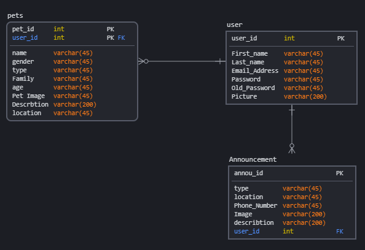

# Happiness Adopter
Our project is considered as an Animal adopter website. You can choose any pets available and adopt it, then will be a happy person!

# Front-end Repository
[Happiness Adopter](https://git.generalassemb.ly/xlightx/FrontEnd-happinessadopter)

# Our Website links
[Deployed API](http://happinessadopter-env.eba-up79mz9d.us-east-2.elasticbeanstalk.com/)

[Deployed Client](https://pages.git.generalassemb.ly/xlightx/FrontEnd-happinessadopter/)

# Technologies 
 - Java
 - Spring Boot
 - MySQL Driver
 - Bootstrap
 - jwt
 - Eclipse
 - Postman
 - MySQL Workbench
 - GitHub 
 - AWS RDS
 - AWS EB
 - Use sqlDBM for create ER diagram.

# Catalog of Routes
   <table>
  <tr><th>Verb</th>  <th>||	URI Pattern	</th></tr>
  <tr><td>POST</td> <td> ||</td> <td>/user/registration</td></tr>
    <tr><td>POST</td> <td> ||</td> <td>/user/authenticate</td></tr>
    <tr><td>GET</td> <td> ||</td> <td>/user/userProfile</td></tr>
    <tr><td>GET</td> <td> ||</td> <td>/pet/index</td></tr>
    <tr><td>GET</td> <td> ||</td> <td>/pet/detail/:id</td></tr>
    <tr><td>POST</td> <td> ||</td> <td>/pet/add/</td></tr>
    <tr><td>PUT</td> <td> ||</td> <td>/pet/edit/</td></tr>
    <tr><td>DELETE</td> <td> ||</td> <td>/pet/delete/:id/</td></tr>
    <tr><td>GET</td> <td> ||</td> <td>/announcement/index</td></tr>
    <tr><td>POST</td> <td> ||</td> <td>/announcement/add/</td></tr>
    <tr><td>PUT</td> <td> ||</td> <td>/announcement/edit/</td></tr>
    <tr><td>DELETE</td> <td> ||</td> <td>/announcement/delete/:id/</td></tr>
  
</table>
		
# ER Diagram

# Team work strategy
- Starting with Create a DB and the relations between our model.
- Create models, controllers.
- Add Security for our application.

# Future Work
- Add (Shop) to our website for all pets needs.
